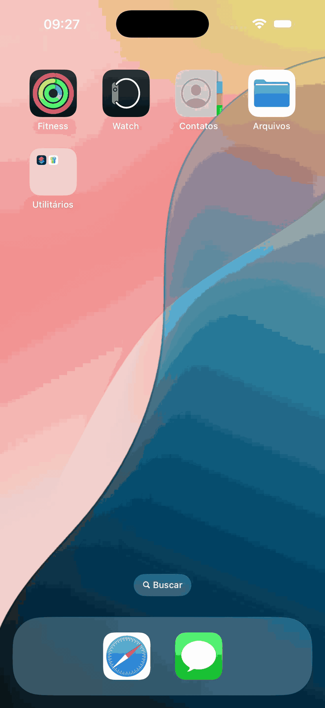

# TVMazeApp

TVMaze app is a native iOS application that allows users to see a list of shows and access its details. It was created using the [TVMaze](https://www.tvmaze.com)’s API.

## Features

### List of Shows 
 - Pagination

 - Local caching

 - Small-size image for items in the list
 - Background data fetching
 - Layout update: list or grid

 - Horizontal layout support

 - Selecting a show must open details page

### Details of a Show 

 - Big-size image
 - Name
 - Year
 - Genres
 - Summary

### Dark mode support

## Usage of the API

The API from the TVMaze website exposes two sets of endpoints: public and restricted. Public endpoints allow general data fetch and search, while restricted allows the manipulation of data associated to specific users from the website (for instance, favorite/unfavorite a show). The restricted API requires authentication with an API key, which isn’t necessary for the public one.  This project is using the public API.

 - [API Documentation](https://www.tvmaze.com/api)

### List all shows
 - It will use the “Show index” endpoint
 - [TV API | TVmaze - Add TV information to your website or app.](https://www.tvmaze.com/api#show-index)
 - The pagination must be done with the argument “page”, starting with value “0”.
 - An “HTTP 404 error” means we reached the end of the list.

### Images of a show
 - In the list
 - When displaying each show in the list, the image to be displayed is the one returned in the object of the response of the previous endpoint.
 - The following property will be used:
 - Show.image.medium (this contains a medium size image to be displayed)
 - If the medium size image is not available, the original image will be used
 - Show.image.original
 - If that’s not available, a local placeholder will be used

### In the details
 - For the details screen, a new endpoint must be called to fetch a more detailed list of available images for the given show.
 - “Show images” endpoint
 - [TV API | TVmaze - Add TV information to your website or app.](https://www.tvmaze.com/api#show-image)
 - The following property will be used to display the image:
 - The first image of “type” “poster”
 - The first image with “true” for the property “main”
 - If no main image is available, the first poster image will be used
 - If no main or poster image is available, a local placeholder will be used.

### Pre fetch policy (pagination)
 - In order to provide a better user experience, the app won’t wait for the user to reach the end of the list of shows to fetch more data. More data must be fetched before the user reaches the end of the list.
 - This must be done in the background, without blocking the UI.

### Local caching policy

In order to provide a better user experience, data must be stored locally after being fetched from the API, and the next time the user accesses the same content, the local data will be used instead of calling the API again, preventing the user from seeing the loading screen and displaying information immediately. 
All the data for the first one thousand items will be stored locally. This includes: shows, episodes and images. Since each page contains 250 items, the first four pages will be stored. The following rules must be followed:
Time to Live (TTL): 15 minutes.
When to store: right after fetching it from the API.
When to delete: when opening the app and trying to fetch the first page; if local data is out of TTL, delete it, reach the internet to fetch data again and store it again.
When to renew TTL: if the user reopens the app within a valid time range; for instance, if the user reopens the app after 5 minutes, the local data will be available for more 10 minutes, but it will be renewed to be valid for more 15 minutes. 
When don’t delete: when the user accesses the app without internet connection. In this case, show local data and a warning that data may be outdated. 
When don’t delete (II): when the API is not available. In this case, show local data and a warning that data may be outdated. 

After the fourth page, the downloaded data will be available only in-memory. 

Since the number of items per page can be changed in the future of the API, the caching logic must take into consideration only the index of the item for which the data is being downloaded. 

### Retry policy

For API requests
If a request fails it must be retried three times.
If all attempts fail it must return an error.
For Image download
If the download of an image fails it must be retried three times.
If all attempts fail it must return an error.

### Fetching first page
If it’s not possible to fetch any data for any reason an error screen with a message must be displayed with a retry button.

# Downloading images
If it’s not possible to download an image a placeholder must be used.

Attention: there are some cases when an image might not be available but there is another option available. The placeholder must be used only in case none of the alternatives could be downloaded. 

Loading state
The app must show a loading while data is being fetched. 
Technical requirements
Reactive programming 
Dependency Injection
VIPER architecture
SOLID principles
Clean architecture principles
Swift Lint
Unit test coverage
Simple CI script
Tech Stack
Combine
Swift UI
Needle (manual)
CoreData

